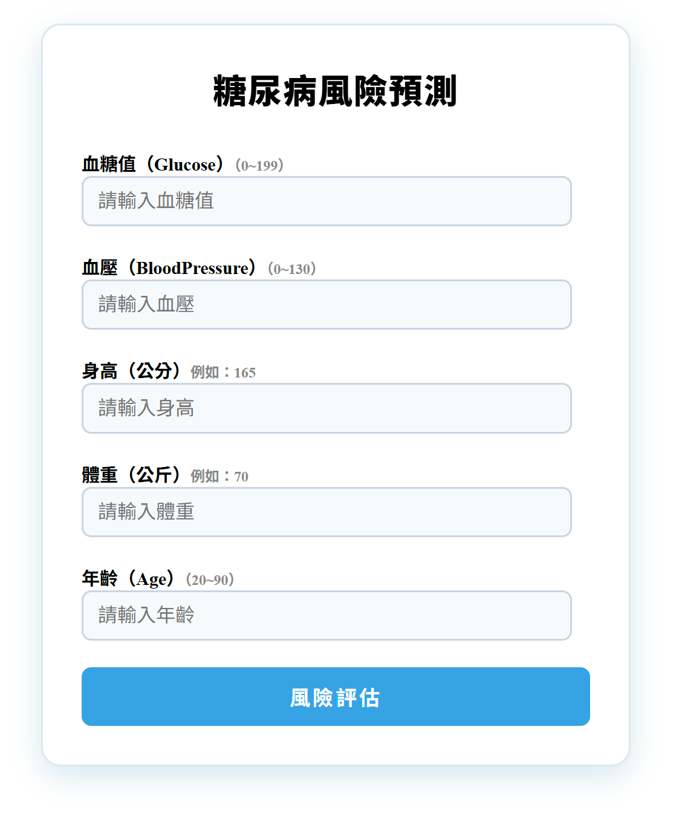
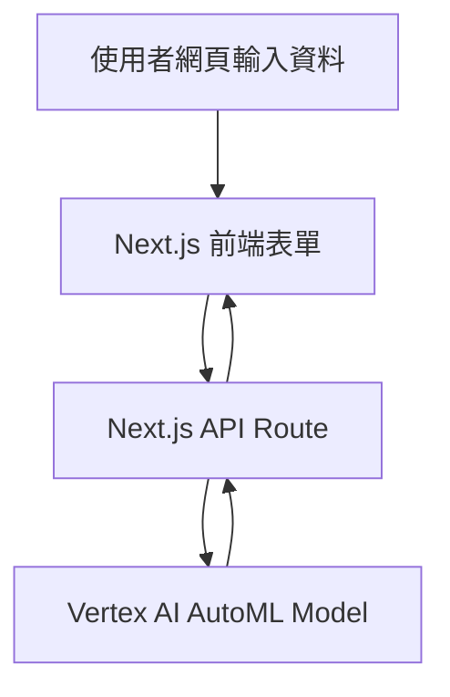

# Vertex AI Diabetes Risk Predictor

## 🩺 專案介紹

這是一個結合 **Google Vertex AI AutoML** 與 **Next.js** 前後端的糖尿病風險預測 Web App。
用戶可輸入血糖、血壓、身高、體重與年齡，系統會計算 BMI，並即時查詢 Vertex AI 機器學習模型，回傳預測患有糖尿病的風險機率。

---

## 🚀 功能特色

- ✨ **美觀直覺的表單輸入與進度條動畫**
- 📦 **自動 BMI 計算**（輸入身高、體重自動換算）
- ⏳ **即時查詢 Google Vertex AI 部署模型**
- 📊 **風險指數百分比友善顯示**
- 📝 **完整 API 回傳內容 JSON 格式化顯示**
- 🔒 **金鑰安全設計，部署雲端方便**

---

## 📸 預覽畫面

> 
>
> 使用者在頁面輸入資料，按下「風險評估」即可獲得風險指數與詳細 AI 回傳內容。

---

## 🖼️ 架構說明



---

## 🛠️ 本地開發與執行

0.  **準備資料與訓練 AutoML 模型（在 Google Cloud Console / Vertex AI）**
    a. 建立 Google Cloud 專案 & 啟用 API
    b. 準備訓練資料集
    c. 建立 AutoML Tabular 訓練任務
    d. 訓練完成後部署模型到 Endpoint
    e. 記錄 REST API 呼叫資訊

1.  **複製專案並安裝依賴**
    ```bash
    git clone https://github.com/你的帳號/vertex-diabetes-nextjs.git
    cd vertex-diabetes-nextjs
    npm install
    ```
2.  **建立 `.env.local` 檔案，填入你的 GCP 專案資訊**
    ```
    GCP_PROJECT_ID=your-project-id
    GCP_REGION=us-central1
    VERTEX_ENDPOINT_ID=your-endpoint-id
    ```
3.  **將 Google Cloud 服務帳戶金鑰（JSON）放到 `credentials/service-account.json`**
    > ⚠️ 請勿將金鑰檔案上傳到 GitHub！
4.  **啟動開發模式**
    ```bash
    npm run dev
    ```
5.  開啟瀏覽器進入 [http://localhost:3000](http://localhost:3000)

---

## 🌎 雲端部署（Render）

1.  **推送專案到 GitHub**
2.  **Render.com 建立新 Web Service，連接此 repo**
3.  **設定 Build Command:**
    ```
    npm install && npm run build
    ```
    **Start Command:**
    ```
    npm run start
    ```
4.  **於 Environment Variables 輸入 .env.local 變數**
5.  **使用 Secret Files 上傳 `credentials/service-account.json`**
6.  **完成部署後，取得公開網址即可使用**

---

## 🛡️ 安全建議

- **金鑰檔案與 `.env.local` 請勿上傳到 GitHub，並務必加入 `.gitignore`**
- 部署雲端請善用 Render（或 Vercel、GCP Cloud Run）的 Secret/Env 功能儲存敏感資料

---

## 📚 相關資源

- Google Vertex AI AutoML 官方文件
- Next.js 官方文件
- Render.com 雲端部署教學

---

## 📝 TODO

- 補充說明如何在 Google Cloud Console / Vertex AI 訓練 AutoML 模型並部署 Endpoint
- 支援更多特徵欄位與模型自訂化
- 增加前端輸入驗證提示與錯誤訊息
- 優化行動裝置響應式設計
- 結果圖表視覺化（如：風險趨勢折線圖、分群雷達圖）
- 多語系（中英文切換）支援
- 支援以 RESTful API 形式對外提供糖尿病風險預測服務（例如 /api/predict 可接受外部 POST 呼叫並回傳結果）

---

## 🏷️ 授權

本專案採用 MIT License。

---
